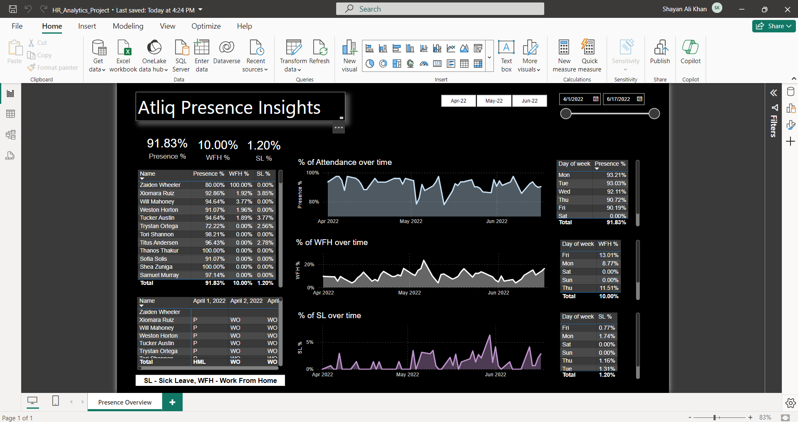

# HR Analytics Power BI Project

This project represents a comprehensive end-to-end solution for analyzing employee presence data within an IT organization using Power BI.

## Overview

The HR Analytics Power BI Project aims to provide actionable insights into employee presence data, enabling HR teams to make informed decisions and streamline their operations. Leveraging Power BI's capabilities, the project involves data extraction, transformation, and visualization to create a user-friendly dashboard for HR professionals.

## Key Features

- **Data Extraction and Transformation:** Extracted employee presence data from an Excel file and performed Extract, Transform, Load (ETL) operations to prepare it for analysis.
- **Data Modeling with DAX:** Utilized Data Analysis Expressions (DAX) to create custom columns and measures, tailoring the data for advanced analytics.
- **Dashboard Design:** Developed a user-friendly Power BI dashboard visualizing essential HR metrics such as working hours, attendance, performance, and leaves.
- **Impact and Efficiency:** The implemented dashboard offers real-time insights, saving the HR team an estimated 3-4 hours of manual work daily.

 
 # Report Snapshot (Power BI DESKTOP)

 

